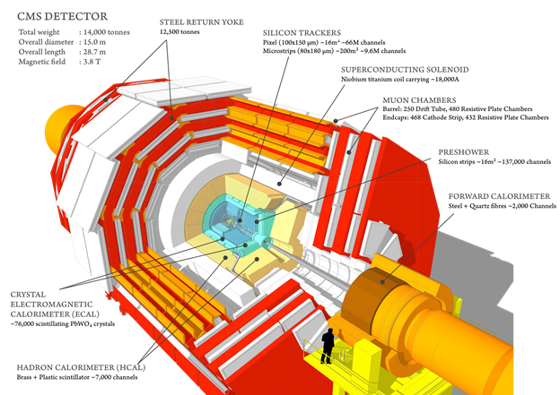

---
title:  'U.S. CMS Compact Muon Solenoid
Operations Program Quarterly Report
for the Period Ending September 30, 2015'
author:
- name: U.S. CMS Operations Program
abstract: |
    \vspace*{-1.0in}
    \ 
tags: [USCMS, report]
bibliography: rb.bib
csl: /Volumes/Users/bauerdic/Docs/_Dev/pandoc-templates/csl/institute-of-physics-numeric.csl
...
\newcommand\myAddRevision{%
  \setlength\unitlength{1mm}
  \begin{picture}(0,0)
    \put(-1,-5){\footnotesize\itshape Rev. 0, compiled \today}
  \end{picture}
}
\makeoddfoot  {qr}{\myAddRevision\hspace*{-0.07in} \small{U.S. CMS Operations Program 2015Q3}}{}{\small Page \thepage}
<!--
\makeoddfoot  {qr}{\small{U.S. CMS Operations Program 2015Q3}}{}{\small Page \thepage}
-->

\pagestyle{qr}

